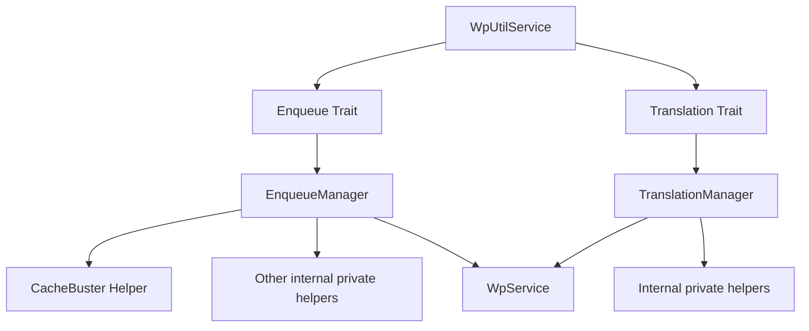

# WpUtilService

`WpUtilService` is a lightweight, developer-friendly service layer for WordPress that wraps `WpService`. It provides a **clear, controlled interface** to common WordPress operations such as enqueuing scripts, adding translations, and more — all while keeping the main service clean and testable.

---

## Why This Design?

- **Single Public Entrypoint per Feature:** Each feature (like enqueueing scripts or translations) is encapsulated in a **trait**. Traits expose exactly **one public method**, preventing API pollution.
- **Feature Managers:** Each public method returns a **manager object** that handles the feature's operations (e.g., `EnqueueManager` for scripts). Managers can contain multiple private/protected methods, helpers, or additional classes (like `CacheBuster`) without exposing internal logic.
- **Fluent API:** Methods on the manager can be **chained**, allowing concise and readable code.
- **Separation of Concerns:** The main service (`WpUtilService`) remains simple, while complex logic is handled by feature-specific classes.
- **Testable and Extensible:** The service depends on `WpService`, which can be swapped for a mock or custom implementation in tests. Additional helpers (like cache-busting, minifiers, etc.) can be injected into managers.

---

## Installation

Add `WpUtilService` to your project using PSR-4 autoloading. Example composer setup:

```json
"autoload": {
    "psr-4": {
        "WpUtilService\\\\": "src/"
    }
}
```

---

## Usage

### Basic Setup

```php
use WpService\\NativeWpService;
use WpUtilService\\WpUtilService;

$wpService = new NativeWpService();
$wpUtilService = new WpUtilService($wpService);
```

---

### Enqueue Scripts and Add Translations

```php
$wpUtilService
    ->enqueue(['distFolder' => '/var/www/dist'])
    ->add('main.js', ['jquery'], '1.0.0', true)->with()->translation(
        [
            'localization_a' => __('Test', 'testdomain')
        ]
    )->add('second.js', [], '1.0.0', true)->with()->data([
            'id' => 1
    ])->with()->translation(['localization_b' => __("Test")])
    ->add('secondary.js');
```

- `enqueue()` returns an `EnqueueManager`.
- `add()` enqueues a script.
- `addTranslation()` adds translation for a script.
- You can chain multiple calls fluently.
- Options like `distFolder` can be used internally by the manager.

---

### Adding New Features

To add a new feature:

1. **Create a trait** with a single public method representing the entrypoint.
2. **Create a manager class** for that feature with all operations and private helpers.
3. **Use the trait** in `WpUtilService`.
4. Consumers interact only through the public entrypoint and manager API.

Example: `Translation` feature

```php
$wpUtilService
    ->translation()
    ->add('main.js', 'my-textdomain');
```

---

### Extending Managers with Helpers

Managers can leverage additional helper classes. For example, `EnqueueManager` can use a `CacheBuster` helper:

```php
$cacheBuster = new CacheBuster();
$scriptWithVersion = $cacheBuster->appendVersion('main.js');
```

The manager keeps this **internal**, so the main service API remains clean.

---

## Diagram of Service Structure



**Explanation:**

- `WpUtilService` acts as the **facade**.  
- Each trait contributes **one public entrypoint** (`enqueue()`, `translation()`).  
- Each public method returns a **manager** object, which handles the feature and contains private helpers.  
- Managers can call **helpers** like `CacheBuster` for extra functionality.  
- Ultimately, the manager delegates to `WpService` to perform the actual WordPress operations.  

---

### Advantages

- Clear, controlled interface.
- One public method per trait; easy to discover.
- Supports **fluent API** and chaining.
- Testable: swap `WpService` for mocks.
- Extensible: add helpers like cache-busting, minification, etc., without changing the service.

---

## Folder Structure

```
src/
├─ WpUtilService.php          # Main service (facade)
├─ Traits/
│  ├─ Enqueue.php             # Trait for enqueue feature
│  ├─ Translation.php         # Trait for translation feature
├─ Features/
│  ├─ EnqueueManager.php      # Manager class for enqueue
│  ├─ TranslationManager.php  # Manager class for translation
│  ├─ CacheBuster.php         # Optional helper
├─ Contracts/
   ├─ Enqueue.php             # Interface
   ├─ Translation.php         # Interface
```

---

## Conclusion

`WpUtilService` provides a **structured, extendable, and fluent** interface to WordPress functionality while keeping your main service lightweight and your code testable. Each feature is isolated in its own trait and manager, and helpers like cache-busting can be composed internally without affecting the public API.